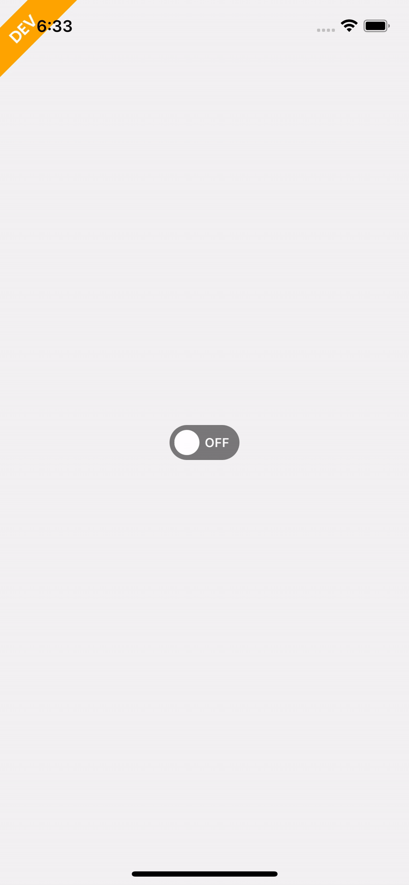

# rn-switch-animated
This is a switch component with animation. We can add custom text for on/off state and these are optionals, also can control background and knob color for both on and off state.



# USAGE

install npm library
```
yarn add rn-switch-animated
```

This library is using @react-native-community/masked-view. Please install if not installed.

```
yarn add @react-native-community/masked-view
```

Import library
```
import Switch from 'rn-switch-animated';
```
use component
```
 const [on, setOn] = useState(false)
  return <Switch
      value={on}
      onChange={setOn}
      animationSpeed={100}
      elevation={0}
      inactiveColor={colors?.colorGreyInactive}
      activeColor={colors.colorPrimary}
      activeText={'ON'}
      inactiveText={'OFF'}
      size={scaler(60)}
      activeTextStyle={{}}
      inactiveTextStyle={{}}
    />
```


SwitchAnimatedProps
```
    value: boolean,
    onChange: (newValue: boolean, e?: GestureResponderEvent) => void,
    activeKnobColor?: string,
    inactiveKnobColor?: string,
    animationSpeed: number,
    elevation: number,
    inactiveColor: string,
    activeColor: string,
    activeText?: string,
    inactiveText?: string
    activeTextStyle?: StyleProp<TextStyle>
    inactiveTextStyle?: StyleProp<TextStyle>
    textStyle?: StyleProp<TextStyle>
    size: number
```


prop names |type |default value | required | comment 
--- | --- | --- | --- | ---
value | Bool |  | required | Value for switch
onChange | Function |  | required | This prop change the state of switch
activeKnobColor | ColorValue | 'White' |  | Changes Nob color for active state
inactiveKnobColor | ColorValue | 'White' |  | Changes Nob color for inactive state
animationSpeed | Number | 100 |  | Changes speed of animation
elevation | Number |  |  | Changes elevation of Switch
inactiveColor | ColorValue |   | required | Background color of inactive switch
activeColor | ColorValue |   | required | Background color of active switch
inactiveText | String |  |  | Text at the side of Nob at inactive switch
activeText | String |  |  | Text at the side of Nob at active switch
activeTextStyle | Style |  |  | Style for active text
inactiveTextStyle | Style |  |  | Style for inactive text
textStyle | Style |  |  | Style for both inactive and active text
size | number | 60 |  | Size of the switch
